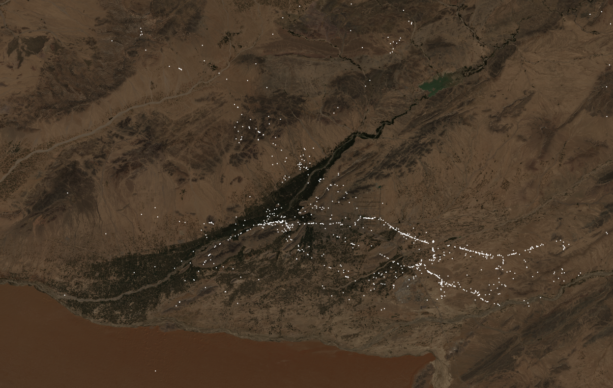

# Safe Atlas : Landmines Identification using satellite imagery

Given an image,

## Environment

You will need,

 - Python >=3.6

 - PostgreSQL >=12.0

 - PostGIS >=3.0

## Dependencies

We suggest working out of a virtual environment

    mkdir venv

    python3 -m venv ./venv/

    source venv/bin/activate

Then installing the dependencies using pip,

    pip3 install -r requirements.txt

## Datatabase

We use PostgreSQL with the [PostGIS extension](https://postgis.net/).

To setup the PostGIS extension on AWS RDS, here is the [article](https://docs.aws.amazon.com/AmazonRDS/latest/UserGuide/Appendix.PostgreSQL.CommonDBATasks.html#Appendix.PostgreSQL.CommonDBATasks.PostGIS)

### Data Model

**incidents**

    CREATE TABLE incidents (
        index INT GENERATED ALWAYS AS IDENTITY,
        datetime TIMESTAMP without time zone NOT NULL,
        geometry geometry(POINT,4326) NOT NULL,
        info character varying(2048) NOT NULL,
        PRIMARY KEY(index)
    )

**imagery**

    CREATE TABLE images (
        index INT GENERATED ALWAYS AS IDENTITY,
        datetime TIMESTAMP without time zone NOT NULL,
        geometry geometry(POLYGON,4326) NOT NULL,
        info JSONB NOT NULL,
        PRIMARY KEY(index)
    )

## Satellite Images

You will need to get an API key from Google Earth Engine. To do so run,

    python3 gee_auth.py

For the images we use,

    https://developers.google.com/earth-engine/datasets/catalog/COPERNICUS_S2_SR

## Data Features

With our source data we consolidate a dataset with the following features,

    - Distance to Persistent Forest
    - Elevation
    - Hill Slope
    - Distance to Border
    - Distance to Roads
    - Distance to Railways
    - Distance to Persistent Forest
    - Distance to Water Channels
    - Distance to Lost Forest
    - Distance to Gained Forest
    - Probability of Built-up
    - Population Density

## Landmines Dataset

We obtained our dataset of landmines event from,

    https://afg.wikileaks-press.is/afg/event/

## Contributors

* **Jean-Romain Roy** - [jeanromainroy](https://github.com/jeanromainroy)

* **Facundo Sosa-Rey** - [FacundoLM2](https://github.com/FacundoLM2)

* **Nicolas Desjardins-Lecavalier** - [Nickydoo](https://github.com/Nickydoo)
